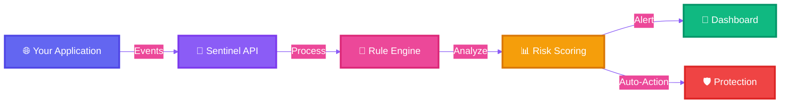
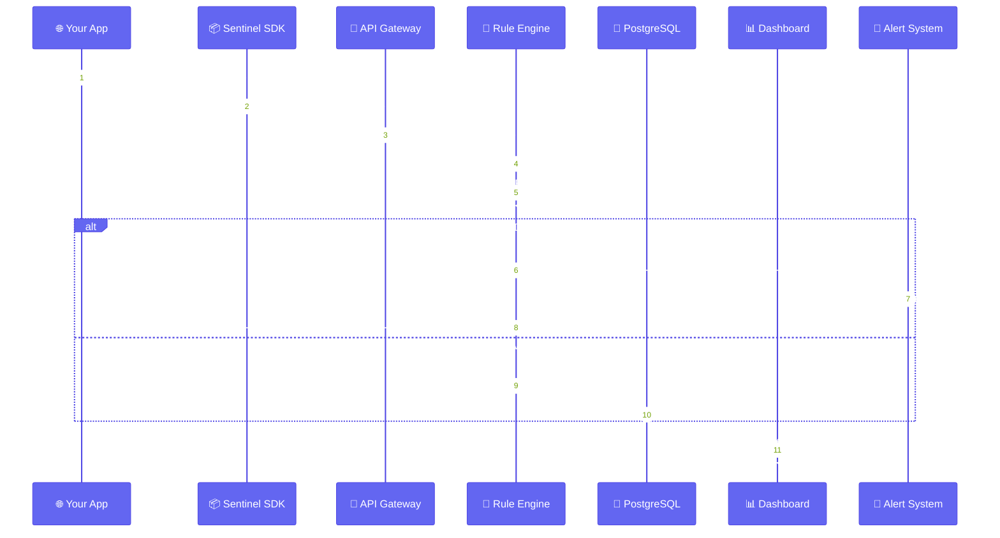
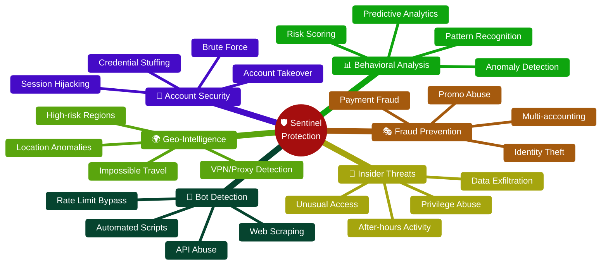
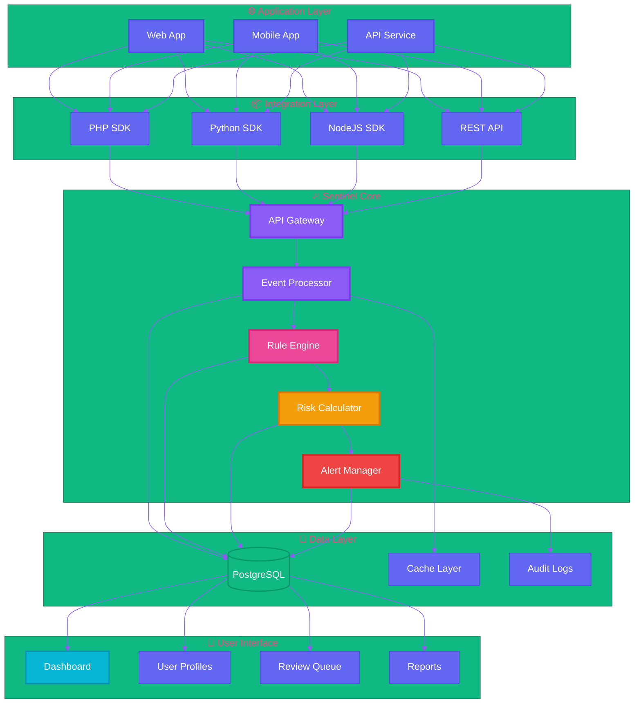
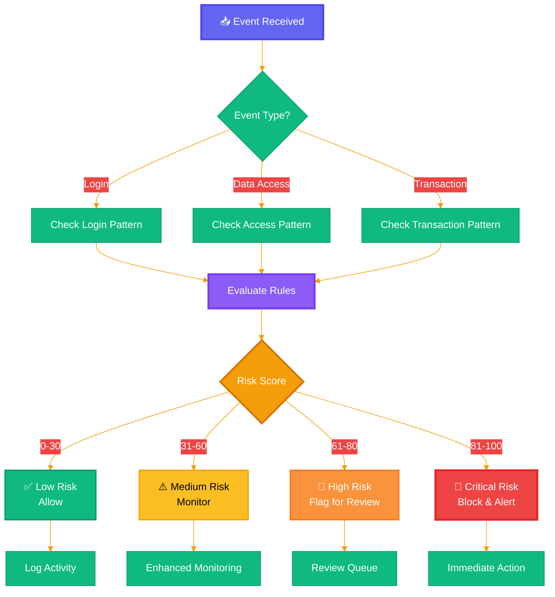
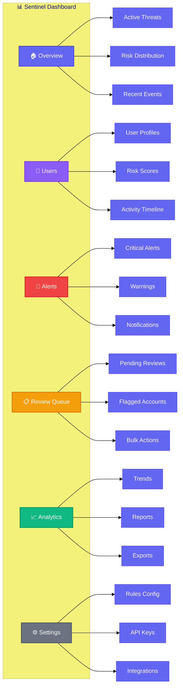
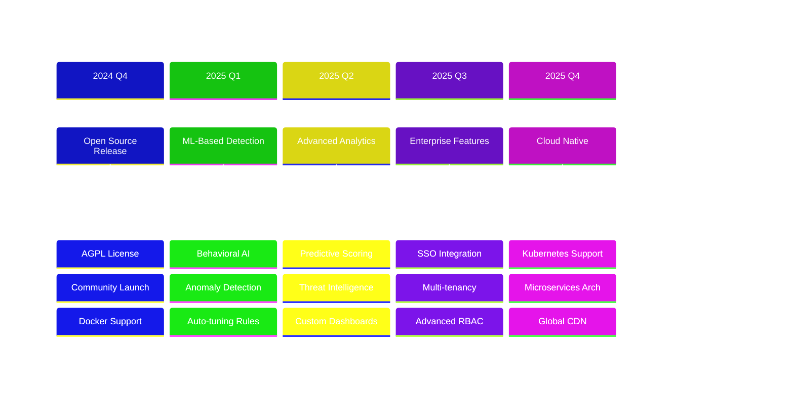

<div align="center">

# 🛡️ Sentinel

### Open-Source Security Framework for Modern Applications

[](https://www.gnu.org/licenses/agpl-3.0)
[](https://www.php.net/)
[](https://www.postgresql.org/)
[](https://hub.docker.com/)
[](https://play.tirreno.com)

**Monitor • Detect • Protect • Respond**

[🚀 Quick Start](#-quick-start) • [📖 Documentation](#-documentation) • [🎯 Features](#-core-features) • [💡 Use Cases](#-use-cases) • [🌐 Live Demo](https://play.tirreno.com)

---

</div>

## 🎯 What is Sentinel?

**Sentinel** is an open-source security framework that embeds protection against threats, fraud, and abuse directly into your application. While traditional cybersecurity focuses on infrastructure and network perimeter, **Sentinel detects threats where they actually happen: inside your product**.



---

## ✨ Core Features

<table>
<tr>
<td width="50%">

### 🔌 **SDKs & API Integration**
- **PHP, Python, NodeJS** SDKs
- RESTful API for any language
- Real-time event ingestion
- Minimal code integration

</td>
<td width="50%">

### 📊 **Real-Time Dashboard**
- Live threat monitoring
- Interactive visualizations
- Custom filtering & search
- Export & reporting

</td>
</tr>
<tr>
<td width="50%">

### 👤 **Single User View**
- Complete activity timeline
- Behavioral analysis
- Connected identities
- Risk score tracking

</td>
<td width="50%">

### ⚙️ **Intelligent Rule Engine**
- 12+ preset security rules
- Custom rule creation
- Automated risk scoring
- Machine learning ready

</td>
</tr>
<tr>
<td width="50%">

### 📋 **Review Queue**
- Automated flagging
- Manual review workflow
- Bulk actions
- Configurable thresholds

</td>
<td width="50%">

### 📝 **Field Audit Trail**
- Complete change history
- Compliance-ready logs
- Who, what, when tracking
- Forensic investigation

</td>
</tr>
</table>

---

## 🔄 How Sentinel Works



---

## 🛡️ Security Detection Capabilities



---

## 🚀 Quick Start

### Option 1: Docker (Recommended) ⚡

```bash
# One-command deployment
curl -sL tirreno.com/t.yml | docker compose -f - up -d

# Access Sentinel
open http://localhost:8585
```

### Option 2: Manual Installation 🔧

```bash
# 1. Download latest release
wget https://www.tirreno.com/download.php -O sentinel.zip

# 2. Extract files
unzip sentinel.zip -d /var/www/sentinel

# 3. Navigate to installer
open http://localhost:8585/install/

# 4. Complete web-based setup
# 5. Delete install directory
rm -rf /var/www/sentinel/install

# 6. Create admin account
open http://localhost:8585/signup/

# 7. Setup cron job
crontab -e
# Add: */10 * * * * /usr/bin/php /var/www/sentinel/index.php /cron
```

### Option 3: Composer 📦

```bash
# New project
composer create-project tirreno/tirreno sentinel

# Existing project
composer require tirreno/tirreno
```

---

## 📊 Architecture Overview



---

## 💡 Use Cases

<details open>
<summary><b>🏢 Enterprise Applications</b></summary>

- **Internal Tools**: Add security layer to legacy systems
- **Audit Compliance**: Track all user activities for SOC2, HIPAA, GDPR
- **Insider Threat**: Monitor privileged user behavior
- **Data Protection**: Prevent unauthorized data access

</details>

<details>
<summary><b>🚀 SaaS Platforms</b></summary>

- **Multi-tenant Security**: Prevent cross-tenant data leakage
- **Account Protection**: Detect and prevent account takeovers
- **Fraud Prevention**: Stop payment fraud and promo abuse
- **Bot Protection**: Block automated abuse and scraping

</details>

<details>
<summary><b>🏭 Critical Infrastructure</b></summary>

- **ICS/SCADA**: Protect industrial control systems
- **Air-gapped Systems**: Self-hosted security for isolated networks
- **Command & Control**: Monitor C2 system access
- **Operational Technology**: Secure OT environments

</details>

<details>
<summary><b>🔌 API-First Applications</b></summary>

- **API Abuse Prevention**: Stop scraping and unauthorized access
- **Rate Limit Enforcement**: Intelligent rate limiting
- **NHI Monitoring**: Track service accounts and API keys
- **Bot Detection**: Identify automated API consumers

</details>

---

## 🎨 Integration Example

### PHP Integration

```php
<?php
require 'vendor/autoload.php';

use Tirreno\Tracker;

// Initialize Sentinel
$sentinel = new Tracker('YOUR_API_KEY', 'http://localhost:8585/sensor/');

// Track user login
$sentinel->track([
    'event' => 'login',
    'user_id' => '12345',
    'email' => 'user@example.com',
    'ip' => $_SERVER['REMOTE_ADDR'],
    'user_agent' => $_SERVER['HTTP_USER_AGENT']
]);

// Track sensitive action
$sentinel->track([
    'event' => 'data_export',
    'user_id' => '12345',
    'records_count' => 1000,
    'data_type' => 'customer_pii'
]);
```

### Python Integration

```python
from tirreno import Tracker

# Initialize Sentinel
sentinel = Tracker(
    api_key='YOUR_API_KEY',
    endpoint='http://localhost:8585/sensor/'
)

# Track user activity
sentinel.track({
    'event': 'login',
    'user_id': '12345',
    'email': 'user@example.com',
    'ip': request.remote_addr,
    'user_agent': request.headers.get('User-Agent')
})

# Track admin action
sentinel.track({
    'event': 'user_delete',
    'admin_id': '67890',
    'target_user': '12345',
    'reason': 'policy_violation'
})
```

### NodeJS Integration

```javascript
const Sentinel = require('tirreno-tracker');

// Initialize Sentinel
const sentinel = new Sentinel({
    apiKey: 'YOUR_API_KEY',
    endpoint: 'http://localhost:8585/sensor/'
});

// Track user event
await sentinel.track({
    event: 'login',
    userId: '12345',
    email: 'user@example.com',
    ip: req.ip,
    userAgent: req.headers['user-agent']
});

// Track API abuse
await sentinel.track({
    event: 'api_rate_limit',
    userId: '12345',
    endpoint: '/api/users',
    requests: 1000,
    timeWindow: '1m'
});
```

---

## 📈 Risk Scoring Flow



---

## 🎯 Preset Security Rules

| Rule | Detection | Action | Use Case |
|------|-----------|--------|----------|
| 🔐 **Account Takeover** | Impossible travel, device change, location anomaly | Alert + MFA | Compromised accounts |
| 🔑 **Credential Stuffing** | Multiple failed logins, known breached passwords | Rate limit + Block | Automated attacks |
| 🤖 **Bot Detection** | Behavioral patterns, request timing, fingerprints | CAPTCHA + Block | Automated abuse |
| 👥 **Multi-accounting** | Device fingerprint, IP correlation, payment methods | Flag + Review | Promo abuse, fraud |
| 💤 **Dormant Account** | Sudden activity after long inactivity | Alert + Verify | Account compromise |
| 🌍 **High-Risk Regions** | Geo-location, VPN/proxy detection | Enhanced auth | Geographic threats |
| 📊 **Data Exfiltration** | Bulk downloads, unusual access patterns | Block + Alert | Insider threats |
| ⚡ **API Abuse** | Rate limiting, scraping patterns | Throttle + Block | Resource protection |
| 💰 **Payment Fraud** | Transaction patterns, velocity checks | Hold + Review | Financial fraud |
| 🎁 **Promo Abuse** | Multiple redemptions, account linking | Limit + Flag | Revenue protection |
| 🔓 **Privilege Escalation** | Unauthorized access attempts | Block + Alert | Security breach |
| 📧 **Content Spam** | Message patterns, velocity, content analysis | Rate limit + Flag | Platform abuse |

---

## 📊 Dashboard Preview



---

## 🔧 System Requirements

| Component | Requirement | Recommended |
|-----------|-------------|-------------|
| **PHP** | 8.0 - 8.3 | 8.3 |
| **PostgreSQL** | 12+ | 15+ |
| **RAM (App)** | 128 MB | 1 GB |
| **RAM (DB)** | 512 MB | 4 GB |
| **Storage** | 3 GB per 1M events | SSD |
| **Web Server** | Apache + mod_rewrite | Apache 2.4+ |
| **OS** | Any Unix-like | Ubuntu 22.04 LTS |
| **PHP Extensions** | PDO_PGSQL, cURL | + mbstring, json |

---

## 🌟 Why Choose Sentinel?

<table>
<tr>
<td align="center" width="25%">
<h3>🆓 Open Source</h3>
<p>AGPL licensed<br/>No vendor lock-in<br/>Community driven</p>
</td>
<td align="center" width="25%">
<h3>🏠 Self-Hosted</h3>
<p>Complete data control<br/>Privacy compliant<br/>Air-gap ready</p>
</td>
<td align="center" width="25%">
<h3>⚡ Fast Setup</h3>
<p>5-minute install<br/>Minimal dependencies<br/>Docker ready</p>
</td>
<td align="center" width="25%">
<h3>🎯 Production Ready</h3>
<p>Battle-tested<br/>Scalable<br/>Enterprise grade</p>
</td>
</tr>
</table>

---

## 📚 Documentation

- 📖 [User Guide](https://docs.tirreno.com/) - Complete usage documentation
- 👨‍💻 [Developer Docs](https://github.com/tirrenotechnologies/DEVELOPMENT.md) - API & integration guide
- 🔧 [Admin Guide](https://github.com/tirrenotechnologies/ADMIN.md) - Installation & maintenance
- 🎮 [Live Demo](https://play.tirreno.com) - Try it now (admin/tirreno)
- 💬 [Community Chat](https://chat.tirreno.com) - Get help on Mattermost

---

## 🤝 Contributing

We welcome contributions! Here's how you can help:

```mermaid
%%{init: {'theme':'base', 'themeVariables': { 'primaryColor':'#10b981','primaryTextColor':'#fff','primaryBorderColor':'#059669'}}}%%
graph LR
    A[🍴 Fork Repo] --> B[🔨 Make Changes]
    B --> C[✅ Test Locally]
    C --> D[📝 Commit]
    D --> E[🚀 Push]
    E --> F[📬 Pull Request]
    F --> G[👀 Code Review]
    G --> H[✨ Merged!]
    
    style A fill:#6366f1,stroke:#4f46e5,stroke-width:2px,color:#fff
    style H fill:#10b981,stroke:#059669,stroke-width:3px,color:#fff
```



1. Fork the repository
2. Create your feature branch (`git checkout -b feature/AmazingFeature`)
3. Commit your changes (`git commit -m 'Add AmazingFeature'`)
4. Push to the branch (`git push origin feature/AmazingFeature`)
5. Open a Pull Request

---

## 🔒 Security

Found a security vulnerability? Please email **security@tirreno.com** instead of using the issue tracker.

**We will:**
- ✅ Confirm receipt within 24 hours
- 🔍 Investigate and reproduce the issue
- 🚀 Release patches for all affected versions
- 📢 Announce the fix in release notes
- 🏆 Credit you (if desired)

---

## 📜 License

This project is licensed under the **GNU Affero General Public License v3.0 (AGPL-3.0)**.

```
Sentinel - Open-Source Security Framework
Copyright (C) 2026 Tirreno Technologies Sàrl

This program is free software: you can redistribute it and/or modify
it under the terms of the GNU Affero General Public License as published
by the Free Software Foundation, version 3.

This program is distributed in the hope that it will be useful,
but WITHOUT ANY WARRANTY; without even the implied warranty of
MERCHANTABILITY or FITNESS FOR A PARTICULAR PURPOSE.
```

[Read Full License](https://www.gnu.org/licenses/agpl-3.0.txt)

---

## 🌍 Community & Support

<div align="center">

[](https://www.tirreno.com)
[](https://play.tirreno.com)
[](https://chat.tirreno.com)
[](https://github.com/tirrenotechnologies/tirreno)

</div>

---

## 🎯 Roadmap



---

## 💖 Acknowledgments

Built with love by security professionals who understand real-world threats.

**Sentinel** is maintained by [Tirreno Technologies Sàrl](https://www.tirreno.com) and the open-source community.

> *"Security is not a product, but a process."* - Bruce Schneier

---

<div align="center">

### ⭐ Star us on GitHub — it motivates us a lot!

[](https://star-history.com/#tirrenotechnologies/tirreno&Date)

**Made with ❤️ for a safer digital world**

[🏠 Home](https://www.tirreno.com) • [📖 Docs](https://docs.tirreno.com) • [💬 Community](https://chat.tirreno.com) • [🐛 Issues](https://github.com/tirrenotechnologies/tirreno/issues)

</div>
